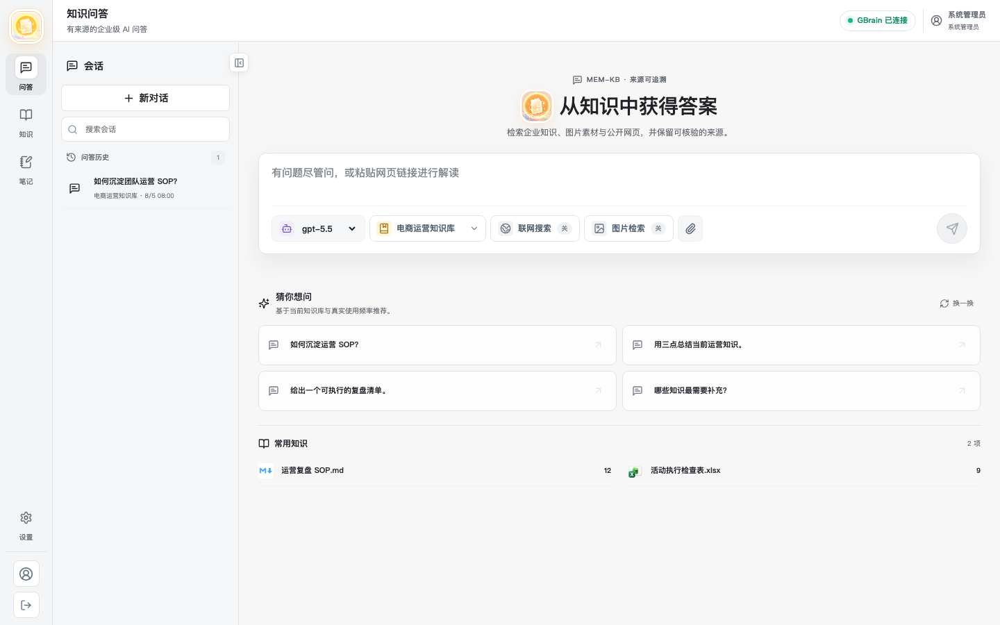
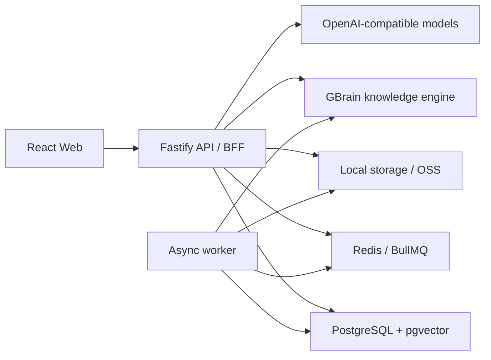

<div align="center">
  
  <h1>MEM-KB</h1>
  <p><strong>让企业知识可检索、可引用、可评测，并在持续使用中自动整理。</strong></p>
  <p>Self-hosted knowledge workspace for sourced RAG, notes, graphs, evaluation, and continuous consolidation.</p>

  <p>
    <a href="LICENSE"></a>
    
    
    
    
  </p>
</div>



MEM-KB 是一个面向团队和个人的开源知识工作台。它把文档、图片、笔记、历史对话和知识图谱组织在 Workspace 中，通过混合检索与可追溯引用提供问答，并用 RAG 评测和夜间巩固持续改善知识质量。

## 为什么选择 MEM-KB

- **答案有来源**：文档范围检索、混合召回、重排和引用链路，便于核验答案依据。
- **知识不止是文件夹**：文档、图片、笔记、实体关系和对话沉淀在同一 Workspace。
- **质量可以量化**：按知识库运行 RAG 评测，查看召回率、准确率、引用正确性、命中/遗漏文档与失败原因。
- **知识持续进化**：定时扫描历史对话，补充实体关系、修复错误引用并整理知识结构。
- **适合自托管**：支持多租户、RBAC、PostgreSQL RLS、本地或 OSS 存储和 OpenAI-compatible 模型网关。

## 功能概览

| 模块 | 能力 |
| --- | --- |
| 知识问答 | 多 Workspace 检索、流式回答、引用、分支对话、联网与图片检索开关 |
| 知识中心 | 文档/图片资产、异步解析、Markdown、分类与商品目录、回收站、知识图谱 |
| 笔记 | Workspace 笔记、富文本编辑、来源回链、问答内容沉淀 |
| RAG 评测 | 召回率、答案准确率、引用正确性、查询明细、失败诊断 |
| 夜间巩固 | 定时任务、知识库范围、实体关系补全、引用修复、运行结果与日志 |
| 平台治理 | 成员与权限、模型配置、Trace、审计、健康检查、微信个人通道 |

## 快速开始

### 1. 环境要求

- Node.js 22+
- npm 10+
- Bun 1.3.10+
- Docker Desktop（推荐，用于 PostgreSQL + pgvector 和 Redis）

### 2. 启动基础设施

```bash
git clone <your-repository-url>
cd mem-kb
npm run infra:up
```

### 3. 配置并安装依赖

```bash
cp backend/app/config/.env.example backend/app/config/.env.local
cp frontend/.env.example frontend/.env.local
npm run install:all
```

至少配置一个 OpenAI-compatible 模型。默认示例读取 `OPENAI_API_KEY`；使用其他网关时，同时修改 `MODEL_BASE_URL` 和 `MODEL_API_KEY_ENV`。

```dotenv
MODEL_BASE_URL=https://api.openai.com/v1
MODEL_API_KEY_ENV=OPENAI_API_KEY
OPENAI_API_KEY=your-api-key
```

### 4. 初始化并运行

```bash
npm run db:setup
npm run dev
```

访问 [http://127.0.0.1:5178](http://127.0.0.1:5178)，开发环境初始账号：

```text
账号：admin 或 admin@mem-kb.local
密码：admin123456
```

> 初始账号只用于本地开发。对外部署前请创建新管理员并更换 `AUTH_SECRET`、数据库密码和全部模型密钥。

核心 API 与 Web 可独立运行；未配置 GBrain 时，长期知识引擎相关能力会降级，但基础知识库与问答界面仍可启动。

## 系统架构



## 项目结构

```text
mem-kb/
├── frontend/                 # React 19 + Vite 前端
│   ├── e2e/                  # Playwright 端到端测试
│   └── src/
├── backend/
│   ├── app/                  # Fastify API、Worker、迁移与单元测试
│   ├── gbrain/               # 长期知识、关系与混合检索引擎
│   └── storage/              # 本地运行数据，不进入 Git
├── deploy/postgres/          # PostgreSQL 初始化与生产部署资源
├── docs/                     # 产品、架构、接口与运维文档
├── scripts/                  # 本地开发与服务编排脚本
├── compose.dev.yml           # 本地 PostgreSQL + Redis
├── docker-compose.yml        # 生产容器编排示例
└── .github/                  # CI、Issue 与 PR 模板
```

## 常用命令

| 命令 | 说明 |
| --- | --- |
| `npm run dev` | 同时启动 Web、API、Worker 和可选 GBrain |
| `npm run dev:web` | 仅启动前端 |
| `npm run dev:api` | 仅启动 API |
| `npm run db:setup` | 创建数据库、执行迁移并写入开发数据 |
| `npm run check` | 类型检查、单元测试和生产构建 |
| `npm run test:e2e` | 运行 Playwright 布局与交互测试 |
| `npm run audit` | 检查高危 npm 依赖漏洞 |
| `npm run infra:down` | 停止本地 PostgreSQL 与 Redis |

## 配置

完整示例见 [`backend/app/config/.env.example`](backend/app/config/.env.example) 和 [`.env.production.example`](.env.production.example)。常用配置：

| 变量 | 用途 |
| --- | --- |
| `AUTH_SECRET` | 会话签名密钥，生产环境至少 32 位 |
| `MODEL_SECRET` | 租户模型密钥的服务端加密主密钥，生产环境至少 32 位 |
| `CHANNEL_SECRET` | 微信上下文凭证的服务端加密主密钥，生产环境至少 32 位 |
| `DATABASE_URL` | PostgreSQL 连接串；也可分别配置 host/user/password |
| `REDIS_HOST` / `REDIS_PORT` | 队列与任务调度 |
| `MODEL_BASE_URL` | OpenAI-compatible 模型网关 |
| `MODEL_API_KEY_ENV` | 模型密钥所在的环境变量名 |
| `GBRAIN_BASE_URL` / `GBRAIN_TOKEN` | GBrain 服务地址与访问令牌 |
| `STORAGE_DRIVER` | `local` 或 `oss` |

生产部署、反向代理、备份与回滚流程见 [`docs/10-deployment-and-operations.md`](docs/10-deployment-and-operations.md)。

## 文档

- [产品范围](docs/01-product-scope.md)
- [页面与交互](docs/02-page-design.md)
- [技术架构](docs/03-architecture.md)
- [API 与数据契约](docs/04-api-and-data-contract.md)
- [混合召回与向量迁移](docs/07-hybrid-retrieval-delivery.md)
- [完整文档索引](docs/README.md)

## 安全

请勿在 Issue 中提交漏洞、令牌或用户数据。报告安全问题前请阅读 [`SECURITY.md`](SECURITY.md)。`.env.local`、本地存储、运行令牌、日志和测试报告已默认排除在 Git 之外。

## 参与贡献

欢迎提交 Issue、设计建议和 Pull Request。开始前请阅读 [`CONTRIBUTING.md`](CONTRIBUTING.md) 与 [`CODE_OF_CONDUCT.md`](CODE_OF_CONDUCT.md)。

## Roadmap

- 可导入的 RAG 基准数据集与评测对比
- 夜间巩固策略插件与人工审核队列
- 更多模型、对象存储和消息通道适配器
- 面向大规模知识库的检索可观测性与成本分析

## License

本项目基于 [MIT License](LICENSE) 开源。
